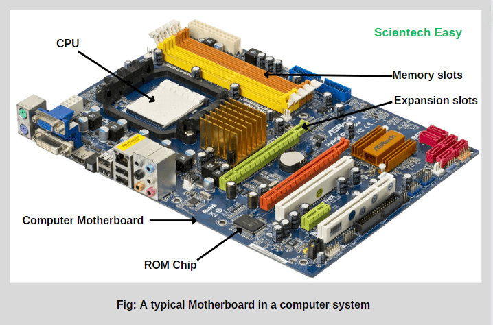
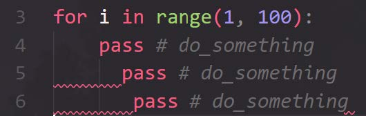
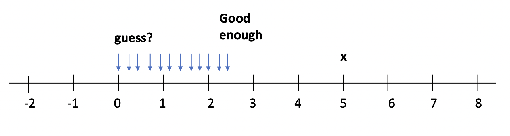
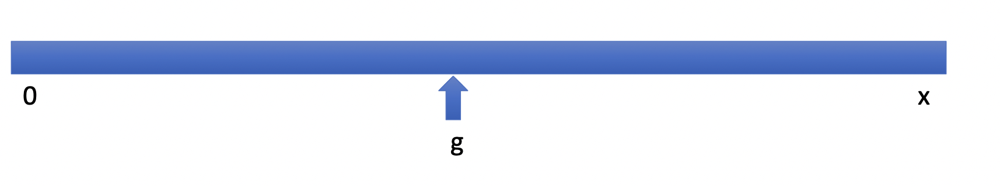
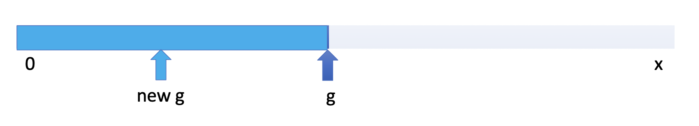
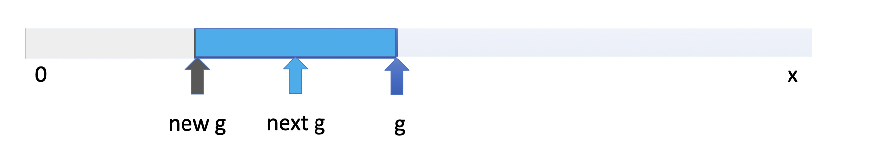
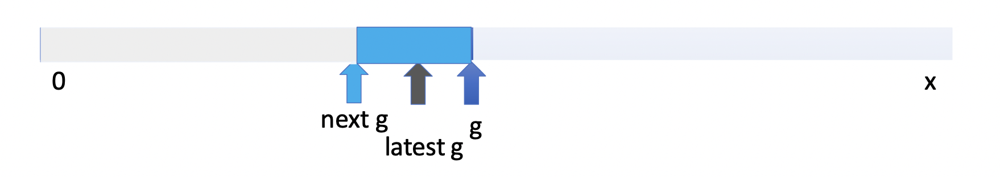

# Administrivia 课程管理说明

<!--v-->

## 关于作业和考试

本学期 SI100B 的 Python 编程 (Python Programming) 部分共有 3 次作业

- 成绩通过在线评判机（Online Judge，简称 OJ）进行评判；

另外还有 1 次考试，时间为第9周，形式为机考，**你无法使用AI等辅助！**

请每位同学**独立**完成作业：如发现有抄袭行为，将按学校规定处理。

不要让 ChatGPT 等 AI 大模型替你完成题目！

- 不仅违反规定，还违背作业的目的：回顾和练习。

<!--v-->

## 关于提问与通知

请尽量在piazza上进行提问，或者前往助教习题课进行提问。

我们在本学期安排了不止一节习题课，每周习题课使用的PPT都是一致的，你可以选择你有空的时间前往。

习题课上欢迎各位的互动，有问题可以及时提出。

考虑到效率与便捷性，资料与通知可能会优先在piazza上发布，请时刻关注piazza、blackboard与你的学校邮箱。

顺便一提，**勤看邮箱**是一个好习惯

<!--s-->

# 0 在开始之前……

<!--v-->

## 有关计算机基本操作的推荐阅读

[你缺失的那门计算机课](https://www.criwits.top/missing/) 入门：计算机快速上手

[MIT: Missing Semester](https://missing-semester-cn.github.io/) 进阶：需配置好 Bash 环境

<!--v-->

## 关于这份PPT

为什么会这么长？

- 因为本学期情况特殊，这一份PPT包含了通识介绍与前三周的全部知识点
- 因此长度上约等于4份正常的习题课PPT，一节习题课不一定讲的完
   - 自学时：无需担心，你可以大胆跳过你已经会的部分 
   - 习题课上：为保证效率，请务必告诉助教**你想复习的知识点**

<!--s-->

# 1 计算机通识

<!--s-->

# 1.1 正确地使用搜索引擎


<!--v-->

## 为什么使用搜索引擎？—— 你应该开始搜索的 101 个理由

- 你现在真的遇到问题了，而遇到问题就应该**解决问题**
- 网上很可能有这个问题的解决方案
- 只靠自己摸索不一定能解决问题
- 可能会搜索到高于这个问题的更深入的知识，扩充你的知识面
- 搜索没有任何的代价
- 这一次没有搞懂，下一次还要再费时间
- 别人通常没有义务帮你解决问题，你应该感谢他们的帮助，但是搜索引擎无所谓！
- 找出思路里面潜在的错误
- ......


（内容改自 SI100B Fall 2024 习题课）
<!--v-->

## 通用的搜索引擎

这些搜索引擎可以解决大部分问题

- Google

- Bing（海外版）

- CN Bing 国内版/百度（仅适合搜索中文社区内容，如“百度贴吧”）

- 百度等中文搜索引擎，编程相关的结果存在较多 AI 洗稿和无意义回答，请注意甄别

<!--v-->

## 如何搜索——关键词

- 搜索一大段描述文字，结果通常不尽人意
  - 搜索引擎有分词功能，但效果有限
  - 长句子即便分词后也有很多杂音

- 清除冗余：搜索 “我该怎么用工具 x 做出 y?” `->` 搜索 “x y”
  - 空格分隔关键词，视情况选择具体的还是更抽象的关键词

- 根据搜索结果调整关键词
  - 结果不应包含某些关键词，那就去掉；
  - 结果给了你新的启发，那就加入相关的关键词；
  - 根据结果不断迭代：
    - 内容太老旧 `->` 限制搜索时间/加年份关键词/加软件版本号
    - 名字一样，但是不是你要搜的领域的东西 `->` 加上领域关键词
    - ......

<!--v-->

## 搜索引擎的高级功能

以 Google 为例，其他搜索引擎使用方式类似

<div style=" margin-top: 10px; margin-right: 20px; margin-left: 20px" markdown="1">

| 功能 | 语法示例 | 说明  |
|------------|--------|--------|
| 强制包含关键词 | `"Python tutorial"` | 使用半角双引号，结果须完全包含引号内的词组 |
| 强制排除关键词 | `Python -Java` | 在词组前加减号，结果中不会出现被排除的词 |
| 模糊匹配 | `Python * tutorial` | 星号 `*` 可匹配任意单词，如可能给出 `Python science tutorial` 的结果|
| 限制搜索网站 | `site:python.org Python` | 只在指定网站中搜索 |
| 限制搜索文件类型 | `filetype:pdf Python` | 只搜索特定文件类型（如 PDF） |

也可以使用浏览器插件实现相关功能。

</div>

<!--v-->

## AI 工具

**常用站点**

- Microsoft Copilot / GitHub Copilot
- ChatGPT、DeepSeek,、通义千问 等专门对话的 AI
- 上科大同学可免费使用校内 GenAI 平台：https://genai.shanghaitech.edu.cn

- 课程中（可能）会教学如何使用 AI 工具，如辅助编程
  - 再次提醒：用 AI 代写作业**违反课程规定！**

<!--v-->

## 如何正确使用对话大模型

- **向大模型提问的正确方式**
  - 搜索引擎的“关键词”式搜索不一定合适
  - 用更加详细的方式描述
  - 任何要求都要写清楚
  - 有些时候，说“不应该怎样”反而会加强错误

- **什么适合问大模型？**
  - 概览性问题 “请总结/简要介绍…”

  - 已有大量数据的问题/常识 “Python的循环体通常有哪些？”
    - **注意：**大模型可能出现幻觉，给出错误数据或不存在的证据
      - 编造某些具体数据、参考文献等

<!--s-->

# 1.2 Python 程序运行的背后：计算机基本构成和运行原理

<!--v-->

## 计算机的构成

<div style=" margin-top: 10px; margin-right: 10px;" markdown="1">



一台计算机通常含有如下组件：

- 中央处理器（CPU）：核心组件，提供运行所需的基本计算能力
- 内存（RAM）：临时储存，速度相对较快，断电后其上数据丢失
- 硬盘（Hard Drive）：有固态 (SSD)，机械 (HDD) 等不同种类；大容量储存，速度相对较慢，断电后其上数据仍保留
- 显卡（GPU）：擅于图形渲染，，批量小规模计算（如矩阵）和并行处理，但计算能力远不如 CPU 通用
- 电源（Power Supply）：向主板（以及显卡）直流供电
- 主板（Motherboard）：卡槽和总线，连接各个部件，提供外部接口（USB、耳机口），可能带有网卡、wifi天线等等
- 风扇：（主要给CPU）散热；显卡往往有独立的散热系统

</div>

<!--v-->

## 拓展：程序是什么

- 在计算机的最底层，所有东西都是**二进制**表示
  - 不同的文件种类，只是**编码 (Encoding)** 不同

- 内存同时存储了**程序**和**数据**
  - **程序 (Program)** 是装有可执行的机器码的文件
    - 机器码 (Machine code)：可以当作是 能被计算机最底层直接理解的操作（最为原始、不加任何修饰的指令），目前不需要深入了解
    - 大部分程序装载到内存中可直接执行，因此也称**可执行文件 (Executable file)**

  - **数据** 在这里指不能被执行，但可被程序所利用的数据（比如变量）

- 程序的工作：由给定的输入计算对应的输出，相当于数学上的**函数**

<!--v-->

## 拓展：程序是什么（续）

- Python 是一种 解释型语言 (Interpreted Language)
  - 我们编写的代码文本文件称**脚本 (Script)** ，终端调用的 `python` 称为**解释器 (Interpreter)**
    - 运行时，解释器将脚本中的语句逐条翻译为机器码并执行

  - 相对地，有 编译型语言 (Compiled Language)
    - 程序需要先全部翻译为机器码，然后才能执行，执行效率比前者更高

- 一些程序不一定能直接执行，但包含许多可被其他程序重复使用的代码
  - 称为**库 （Library）**
  - 可能是文本形式的代码（如 Python module），也可能是二进制的机器码（如 C++ 的动态链接库）
  - Python 中，打包好的库常以 Python 软件包的形式安装和使用

<!--v-->

## VS Code 与 Python

- VS Code 是**代码编辑器**。其核心部分为文本编辑器（与记事本同类）
  - 它**不是 IDE（集成开发环境）**：不能仅用它来直接开发程序
  - Python 解释器是独立于它存在的（比如，你可以在终端直接运行 `python3`）
- VS Code 内置或可添加许多有利于编程的功能：
  - 内置了代码高亮、括号匹配等功能
  - 安装对应插件，可为编程语言提供更全面的支持
- 编辑器和 IDE 都可以统一管理项目文件，并配合外部工具实现版本控制和可视化调试等功能


<!--v-->

## Facts about Python

- 'The Zen of Python': 输入 `import this`
- 来自 1989 年 Guido Van Rossum 在圣诞节期间的业余项目

- 得名于喜剧片 Monty Python’s Flying Circus《巨蟒与圣杯》，不单单是蟒蛇

- Python 程序可以被编译成其他语言，（包括C、Javascript、Julia），或者直接编译为机器码

- Python 执行性能通常不如 C/C++/Java 等，但有部分第三方库使用其他语言编写以实现高效运行（e.g. numpy 库底层使用了 C 语言编写）

<!--v-->

## Imperative vs. Declarative

- 命令式 (Imperative) 编程：告诉计算机要怎么做 (How)
  - 程序员拥有更高的自由度，但需要管理每一步的状态，工作量大
  ```python
  # 求数组 arr 中所有元素的和
  total = 0
  for i in arr:
    total += i
  ```
- 声明式 (Declarative) 编程：声明我们想要的结果 (What)
  - 具体实现由其他人完成并交给编译器或解释器来处理
  - 程序员只需专注于目标本身的逻辑
  ```python
  # 求数组 arr 中所有元素的和
  total = sum(arr) # 他人已实现一个求和的功能，拿来用即可
  ```

<!--v-->

## Computers are Machines that Executing Algorithms

计算机是执行算法的机器

- 算法 (Algorithm) : 需要按次序执行的一系列计算操作

  - 相当于食谱/制作配方（只不过有时很复杂）

  - 本课程目前涉及的算法大多较为简单直观
    - 学习更一般且有难度的算法: CS101 算法与数据结构

- 计算机的架构: 冯·诺依曼 (Von Neumann)
  - Fixed Program (固定程序) vs. Stored Program (存储程序): 
      
    程序不可再修改 vs. 程序可再修改 

  - 架构图: Memory 内存, Control Unit 控制单元, Arithmetic Logic Unit 算术逻辑单元, Input 输入, Output 输出

<!--v-->

## Syntax & Semantics

- 句法 (syntax) : 句子的形式或结构

  - 词位 (lexeme) : 最基本的语法单位(eg. I, dog, hugs，+, =)

  - token: 描述词位的种类 (eg. keywords，operators)

- 语义 (semantics) : 句子含义

- 无语法错误和无静态语义错误：静态分析通过

  - 这**不代表**程序能按照预想的执行

  - “运行的时候没有红字报错，但出来的结果就是不对”

  - 语义难以准确传递：甲方/题目 -> 程序员 -> 代码

- 更高阶的知识： CS131《编译原理》（CS 专业选修）
  
<!--s-->

# 2 Python 基础（Lec 1）

<!--s-->

# 2.1 基础概念介绍

<!--v-->

## 对象
Python 中的一切都是对象。对象分为两类：

1.  标量对象 (Scalar Objects)：不可再分的最小单元
    - `int`：整数（如 `5`, `-100`）
    - `float`：浮点数/实数（如 `3.14`, `2.0`）
    - `bool`：布尔值（`True`, `False`）
    - `NoneType`：只有一个值 `None`，表示“无”或空
2.  非标量对象 (Non-scalar Objects)：有内部结构的（如列表 `list`、字符串 `str`）

> 你可以用 `type()` 函数查看任何对象的类型，例如 `type(5)` 会返回 `<class 'int'>`

<!--v-->

## 类型转换 (Type Conversion)

- 显式 (Explicit) 转换: 需要手动指定转换类型
  - e.g. `str()`,`int()`,`float()`

- 隐式 (Implicit) 转换: 在解析时自动转换
  - “不一定按照预想的执行”：“怎么输出都跟了个 .0？”

  - 通常向上转换类型，以防止数据丢失
  ```python
    num1 = 2
    num2 = 12.2
    res = num1 + num2

    print("Data type of res: ", type(res)) # Output: <class 'float'>

    print("Value of res: ", res) # Output: Value of res: 14.2
  ```

<!--v-->

## 类型转换 (Type Conversion) 续

简单的类型转换示例
* `float(3)` $\rightarrow$ `3.0`
* `int(3.9)` $\rightarrow$ `3`（注意：**直接截断**，不是四舍五入！）

隐式 (Implicit) 转换是某些不同类型数据能够“兼容”的原因
- 但并非所有数据类型都互相“兼容”

  ```python
    num1 = "2"
    num2 = 3
    print(num1 + num2) 
    # TypeError: unsupported operand type(s) for +: 'int' and 'str'
  ```

<!--v-->

## 表达式 (Expressions)

表达式是“对象”和“操作符”的组合。Python 在执行时会将表达式**求值 (Evaluate)** 得到一个单一的值。

- `i / j`：结果永远是 `float`
- `i // j`：**整除**，只保留整数部分
- `i % j`：**取模**，求余数
- `i ** j`：**幂运算($i^j$)**

<!--v-->

## 变量与赋值 (Variables & Assignment)

在计算机科学中，`=` 号不是数学上的“等于”，而是**赋值 (Assignment)**。

```python
pi = 355 / 113
```

实际上做了两件事：
1. 计算等号右边的值。
2. 将这个值**绑定 (Bind)** 到左边的变量名 `pi` 上。

<!--v-->

## 重新绑定 (Re-binding)

变量就像是一个标签，你可以把它撕下来贴在另一个物体上。

```python
radius = 2.2
area = 3.14 * (radius ** 2)
radius = radius + 1
```

- `area` 的值**不会自动更新**。除非你再次显式地计算一次 `area = ...`。
- 为什么叫重新绑定？
   - radius指向的对象从 `2.2`变成了 `3.2`


<!--s-->
# 2.2 代码风格(Coding Style)

<!--v-->
## 为什么要有良好的代码风格？
> There are only two hard things in Computer Science: cache invalidation and naming things.
>
>  ---Phil Karlton
- 方便自己检查 bug
- 方便合作者阅读代码
- 阅读/写出赏心悦目的代码能让人心情愉悦

<!--v-->
## 遵循 PEP 8 规范
Python 创建了一个官方的编码风格规范：[PEP 8](https://peps.python.org/pep-0008/)，以保持不同开发者编写的代码风格的一致性。

1. 使用3个空格进行锁进。
2. 每行不超过79个字符。
3. 变量命名约定：
   - 对于普通变量，使用蛇形命名法，例如：max_value.
   - 对于常量，使用全大写字母，并使用下划线连接，例如：MAX_VALUE。
   - 对于仅供内部使用的变量，在其前面添加下划线前缀，例如：_local_var。
   - 对于与Python 关键字冲突的变量名，在变量末尾添加下划线，例如：class_。

<!--v-->
## 描述性的变量名
- 代码大量使用描述性较弱的变量名，读者将很难理解代码的含义。例如
 <div style=" margin-top: 10px; margin-right: 20px; margin-left: 20px" markdown="1">

| weakly descriptive | strong descriptive | 
|:---:|:---:|
| data | file_chunks | 
| temp | pending_id | 
| result | active_menber | 
</div> 

- 一些特殊情况：
  - 数组索引 `i,j,k`
  - 一些整数 `n`
  - 一个临时字符串 `s`
  - 一个异常 `e`
  - 文件对象 `fp`

<!--v-->
## 两种最常见的命名规范
- 驼峰命名法（Camel Case）：第一个单词首字母小写，其余单词首字母答谢，此法常用于方法名:
  - firstName
  - findLocation
- 下划线命名法（Snake Case）：所有单词用下划线连接。
  - first_name
  - find_location

<!--v-->
## 善用空格
- 肉眼可利用空格快速区分代码的不同部分
- 在二元运算符（如`+`、`-`、`==`、`>` 和`=`）前后使用空格，明确区分运算符和操作数。例如：`1 + 1`，`ans += 1`
- 在 “,” 后使用空格。例如：`func(a, b, c)`

<!--v-->
## 缩进
- 可以选择使用 4 个空格（PEP8 规范）、2个空格（Google style）或 1个 tab 作为缩进方式。
- 必须在所有代码中保持相同的缩进方式


<!--v-->
## 减少无意义注释（Comment）
- 没有编译器或者解释器的相助，编写和维护注释需要更多的时间成本
- 试图通过更好的命名替代注释
```python
# HTTP response code indicates can't find the requested resource 
if stauts_code == 404:
  ...
```
```python
HTTP_NOT_FOUND = 404 
if stauts_code == HTTP_NOT_FOUND:
  ...
```

<!--s-->
# 3 字符串、IO与条件分支（Lec 2）

<!--s-->
# 3.1 字符串（String）

<!--v-->
## 字符串的基础概念
**字符串（简称 str）** 是用来表示文本的**对象**。

**如何创建字符串？**
在Python中，我们使用**引号**来包裹文本，告诉计算机：“这是一个字符串”。你可以使用**双引号 (`""`)** 或 **单引号 (`''`)**，但一定要保持一致。
```python
a = "me"   # 使用双引号
z = 'you'  # 使用单引号
```

<!--v-->
## 字符串的拼接与重复
字符串可以以一种合乎算数逻辑的方式进行运算：
*   **加号 (`+`)：** 用于**拼接（Concatenation）**，把两个字符串连在一起。
*   **乘号 (`*`)：** 用于**重复（Repeat）**，把字符串复制若干次。

课件上的例子：
```python
a = "me"
b = "myself" 
c = a + b             # 结果: "memyself"
d = a + " " + b       # 结果: "me myself" (注意中间加了一个包含空格的字符串)
silly = a * 3         # 结果: "mememe" (重复3次)
```

<!--v-->
## 字符串操作：长度 (len)
`len()` 是一个内置函数，用来获取括号内字符串的**长度（字符个数）**。
```python
s = "abc"
chars = len(s) # 结果是 3，因为有a, b, c三个字符
```
注意，空格也算长度！因此
```python
s = "a b c"
chars = len(s) # 结果是 5，因为有a, b, c三个字符和两个空格
```

<!--v-->
## 字符串索引（Indexing）：获取单个字符

我们使用方括号 `[]` 进行索引获取特定的某个字符。

**注意：** 在计算机世界里，计数通常是**从 0 开始**的！

*   **正向索引：** 0 是第一个字符，1 是第二个，依此类推。
*   **反向索引：** 如果你想从后往前取，最后一个字符的索引是 -1，倒数第二个是 -2。

```python
s = "abc"
# s[0] -> "a"
# s[1] -> "b"
# s[2] -> "c"
# s[3] -> 报错！(Error: 越界了，因为一共只有3个字符，最大索引是2)
# s[-1] -> "c" (最后一个)
# s[-2] -> "b"
# s[-3] -> "a"
```

<!--v-->
## 字符串切片（Slicing）：获取子字符串

如果你想获取的不是一个字符，而是一段字符，就要用到**切片**。

语法是：`s[start:stop:step]` （`[起始位置:结束位置:步长]`）
*   **start:** 从哪个索引开始提取（**包含**这个位置）。
*   **stop:** 到哪个索引结束（**不包含**这个位置！也就是提取到 stop-1 为止）。
*   **step:** 步长，即每次跳几步。默认是 1（挨个取）。如果是正数，从左往右取；如果是**负数**，则**从右往左**取。

课件中的例子：
```python
s = "abcdefgh"
# s[3:6] -> 从索引3('d')取到索引5('f') -> "def"
# s[3:6:2] -> 从3取到5，步长是2。取了索引3('d')，跳过4，取索引5('f') -> "df"
# s[:] -> 省略起止位置，代表从头取到尾 -> "abcdefgh"
# s[::-1] 省略起止位置，步长为-1，代表将整个字符串倒序 -> "hgfedcba"
# s[4:1:-2] -> 步长是-2。从索引4('e')开始，取到索引2，即取索引4和2-> "ec"
```

<!--v-->
## 小练习

```python
s = "ABC d3f ghi"
# s[3:len(s)-1]:
# s[4:0:-1]:
# s[6:3]:
```
注意里面有空格，空格也是字符!

 *   `s[3:len(s)-1]` -> len(s)是11，11-1是10。从索引3取到9。索引3是空格，索引9是'h'。结果是：`" d3f gh"`
 *   `s[4:0:-1]` -> 从索引4('d')往左取到索引1(不包含0)。分别取索引 4,3,2,1 对应的字符。结果是：`"d CB"`
 *   `s[6:3]` -> 起点6大于终点3，但默认步长是正数1（向右走），方向矛盾，无法提取。结果是：`""`（空字符串）

<!--v-->
## 字符串的不可变性（Immutable）
在Python中，字符串是**不可变的（Immutable）**。这就意味着，字符串一旦创建，你就不能修改它内部的某个字符。
```python
s = "car"
s[0] = 'b' # 这会报错！(Error) 因为你试图把 'c' 强行换成 'b'。

# 正确的做法是：利用切片拼接，生成一个新的字符串，并重新绑定给变量 s
s = 'b' + s[1:len(s)] 
# 现在 s 变成了 "bar"
```

<!--v-->
## 什么变了，什么没变

可能有同学好奇，在上一个例子中，s的值不是还是可以改变的吗？

请注意，s不是字符串本身，只是一个变量，旧的字符串是`"car"`，新的字符串是`'b' + s[1:len(s)]`，也就是`"bar"`，这两个字符串之间没有任何关系。

也就是说，上面实际上执行了Re-binding的操作。

**BIG IDEA**：If you are wondering "what happens if"… Just try it out in the console!

这里还可以插进来另外一条BIG IDEA：Expressions can be placed anywhere.

因为你会发现表达式`'b' + s[1:len(s)]`实际上可以被看做他的结果`"bar"`参与赋值（或者运算、判断）等操作，这一点在布尔类型中更加明显！

<!--s-->
# 3.2 输入与输出（IO）

<!--v-->
## 为什么输入输出那么重要？

当你在写一个程序的时候，你实际上构造了一个用于实现某种目的的机器。

这个机器获取输入，经过运算与操作，最终给出一个输出。

因此，输入与输出是你的程序与外界交互的方式。

以电脑的使用举例，当你敲击键盘或者点击鼠标时，你实际上向你的电脑提交了一个输入，当你看向屏幕上的变化时，你的电脑实际上给了你一个输出。

可以预见的是，如果你失去了鼠标键盘或者屏幕，你将无法使用电脑。程序也遵循这一逻辑。

**Special Tips**：当你的程序无论如何都无法通过OJ时，不妨优先检查一下你的输入输出的格式是否符合题目的要求。

<!--v-->
## 输出：`print()` 函数
用来把结果打印到控制台屏幕上供我们查看。
*   你可以打印运算结果：`print(3+2)` 屏幕上会显示 `5`。
*   你可以一次打印多个内容，用**逗号（`,`）**隔开。Python会自动在它们之间加上**空格**。
*   你也可以用加号（`+`）拼接字符串后再打印。

```python
a = "the"   
b = 3
c = "musketeers"  
print(a, b, c)             # 结果: the 3 musketeers (自动加空格)
print(a + str(b) + c)      
# 结果: the3musketeers (用 str(b) 将数字转为字符串，+号直接紧密相连无空格)
```

<!--v-->
## 输入：`input()` 函数
`input("提示语")` 会在屏幕上打印提示语，然后**暂停程序**，等待用户在键盘上敲击内容并按下回车键。它会把用户输入的内容作为一个值赋给变量。

**陷阱：** `input()` 获取到的内容，**永远都是字符串 (str)**！哪怕你认为你输入的是数字 3，计算机看到的也是字符串 `"3"`。

课件中的例子：
```python
num1 = input("Type a number: ")  # 假设用户输入了 3。此时 num1 是字符串 "3"
print(5 * num1) # 字符串乘法！打印出 "33333"

# 如果我们需要做数学运算，必须进行类型转换 (cast)
num2 = int(input("Type a number: ")) # 用 int() 把获取到的 "3" 转换为整数 3
print(5 * num2) # 数字乘法！打印出 15
```

<!--v-->
## 特殊情况下不要添加提示语

**陷阱：**遇到`input()`就往括号里添加提示语，然后提交到OJ进行评测，然后所有答案WA（"Wrong Answer"）

这是为什么？

思考一下，你是不是在终端中看到了你自己写的提示语？

这代表着什么？代表终端**输出**了你的提示语！

那么当OJ检查你的输出是否正确时，就会看到你的提示语，然后毫无疑问会认为你的答案是错误的，因为**你的输出与OJ期望的输出不一致**。

<!--v-->
## F-Strings（格式化字符串）

这是Python 3.6引入的特性，让打印混合了文字和变量的句子变得极其简单！
语法：在字符串引号前加一个小写的 **`f`**。然后在字符串里，把变量或表达式放进**大括号 `{}`** 里。计算机在运行时会自动计算 `{}` 里的内容，并变成字符串拼进去。

```python
num = 3000
fraction = 1/3
# 传统写法：
print(num*fraction, 'is', str(fraction*100) + '% of', num)  

# F-string：
print(f'{num*fraction} is {fraction*100}% of {num}')
# 结果: 1000.0 is 33.33333333333333% of 3000
```
**(BIG IDEA)：** 表达式（Expressions）可以放在任何地方，Python 会自动去计算它的值。

<!--s-->
# 3.3 条件分支（Conditional Branching）

<!--v-->
## 赋值 `=` vs 是否相等 `==`

在计算机科学中，有两种“等于”的概念：
*   **赋值（Assignment） `=` ：** 单个等号。表示一个动作，把右边的值赋给左边的变量。（例如 `a = 5`，意思是“把5赋值给变量a”）
*   **是否相等（Equality test） `==` ：** 两个等号。它是一个**问题**，意思是“左边和右边相等吗？”。它不改变任何变量的值，而是返回一个答案：`True`或者 `False`（布尔值）。

<!--v-->
## 布尔类型（Boolean）与比较运算符
布尔类型非常简单，它只有两个值： **`True`（真）** 或 **`False`（假）**。
我们使用比较运算符来得出布尔值：
*   `>` (大于), `>=` (大于等于)
*   `<` (小于), `<=` (小于等于)
*   `==` (等于)
*   `!=` (不等于)

<!--v-->
## 逻辑运算符 (Logical Operators)
当我们有多个条件需要组合时，比如“必须有门票 **并且** 必须满18岁”，我们使用逻辑运算符操作布尔值：
*   **`not a` (非)：** 如果 `a` 是 True，`not a` 就是 False。
*   **`a and b` (与)：** 必须**两个都**是 True，结果才是 True。一假则假。
*   **`a or b` (或)：** 只要**有其中一个**是 True，结果就是 True。全假才假。

**示例：猜数字输出布尔值**
```python
secret = 7
guess = int(input("Guess the number: "))
print(guess == secret) # 如果输入7，打印True；否则打印False
```

<!--v-->
## Python 中的分支语法 (`if`, `elif`, `else`)
Python 根据条件判断的结果，决定走哪条路。
语法结构如下（注意**冒号**和后面的**缩进**）：

```python
if <条件1>:
    代码块A  # 如果条件1为True，执行这里的代码
elif <条件2>:
    代码块B  # 如果条件1是False，但条件2是True，执行这里 (elif 是 else if 的缩写)
else:
    代码块C  # 如果前面的条件全都是False，作为兜底，执行这里
```
**运行规则：** 程序从上往下检查条件，只要遇到**第一个**为 True 的条件，就执行其对应的代码块，然后直接跳出整个分支结构，忽略后面的其他 elif 或 else。

tips：<条件>实际上接受一个布尔值，所以if True 是合法的！

<!--v-->
## 缩进（Indentation）与嵌套
Python 是世界上少数使用**缩进（前面的空格）**来区分代码块的语言。缩进不仅仅是为了排版好看，它直接决定了代码的逻辑走向！
通常按一次 `Tab` 键或敲 4 个空格（2个也行，可以在编辑器中进行设置）作为一级缩进。但是不要混合使用！

**修复有 bug 的代码：**

**错误代码：**
```python
x = int(input("Enter a number for x: "))
y = int(input("Enter a different number for y: "))  
if x == y:
print(x,"is the same as",y)  # 错误1：if后面的代码没有缩进，运行时直接报错！
print("These are equal!")    # 错误2：不管 x 和 y 相不相等都会打印。
```

<!--v-->
**修复后的代码：**
```python
x = int(input("Enter a number for x: "))
y = int(input("Enter a different number for y: "))  
if x == y:
    print(x,"is the same as",y)  
    print("These are equal!")
```

<!--v-->
## 完整的猜数字游戏
**任务** 存一个数字，让用户猜，告诉他是太高了、太低了还是猜对了。

**代码解答：**
```python
secret = 42
guess = int(input("Guess my secret number: "))

if guess < secret:
    print("Too low!")
elif guess > secret:
    print("Too high!")
else:
    print("You guessed it! They are the same.")
```

**(BIG IDEA)：** 提早调试，经常调试（Debug early, debug often）。写一小段代码就测试一下，不要一次性写几百行才运行。

<!--s-->
# 4 循环（Lec 3）

<!--s-->
# 4.1 while 循环

<!--v-->
## 为什么需要循环？
你不小心闯入了一片“迷失森林 (Lost Woods)”。如果你一直往右走，你永远都会在原地打转。
如果你用之前学过的 `if` 条件语句来写这段逻辑，代码会是这样的：
```python
if 往右走:
    背景设为迷失森林
if 往右走:
    背景设为迷失森林
# ... (你要写无数个 if)
else:
    背景设为出口
```
你会发现，你不可能在代码里写上一万个 `if`。为了解决这种“**需要不断重复做某件事，直到满足某个条件才停止**”的情况，我们就需要用到**循环（Loops）**，而在这一特殊情况下，我们应该使用**while循环**。

<!--v-->
## `while` 循环的语法
```python
while <条件>:
    代码块 1
    代码块 2
```

**运行规则：** 
* 计算机首先计算 `<条件>` 的布尔值（`True` 或 `False` ）。
* 如果是 `True`，就执行下面缩进的代码块。
* 执行完一次后，计算机会**回头再次检查**条件。只要条件还是 `True`，就会一直重复执行，直到条件变成 `False` 为止。

如果条件永远不变成 `False`，程序就会陷入**死循环（Infinite loop）**。

<!--v-->
## 案例演示
**逃离迷失森林**
```python
# 询问用户往哪边走
where = input("你在迷失森林里。向左走还是向右走？") 

# 只要用户输入的是 "right" ，就一直循环
while where == "right":
    # 再次询问
    where = input("你在迷失森林里。向左走还是向右走？") 

# 只有当 where 不等于 "right" 时，循环才会结束，运行到这里
print("你走出了迷失森林！")
```

<!--v-->
## 结合条件分支

**任务：** 修改迷失森林代码，如果用户在循环里卡了超过2次，就打印一句话。

```python
where = input("向左走还是向右走？") 
counter = 0  # 用一个变量作为计数器

while where == "right":
    counter = counter + 1  # 每次进循环，计数器加1
    if counter > 2:
        print(":( 你已经卡在这里很久了...")
    where = input("向左走还是向右走？") 
    
print("你逃出来了！")
```

<!--s-->
# 4.2 for 循环

<!--v-->
## 为什么需要for循环？

虽然 `while` 循环很强大，但在**遍历一个已知序列**（比如数数从0到4）时，写起来有些繁琐。Python 为我们提供了一个更简洁的捷径： **`for` 循环**。

对比一下：
```python
# while 循环（还容易忘记写 n=n+1 导致死循环）
n = 0
while n < 5:
    print(n)  
    n = n + 1

# for 循环（简洁明了）
for n in range(5):
    print(n)
```

<!--v-->
## `for` 循环的结构
```python
for <变量> in <数值序列>:
    代码块
```
每次循环，`<变量>` 就会依次“抓取”序列中的下一个值，然后执行代码块中的操作，直到序列里的值被抓完为止。

注意，这个序列的形式可以非常多样！下面介绍的`range` 函数只是其中一种形式！

<!--v-->
## `range()` 函数
`range()` 是专门用来生成一串连续整数序列的工具，和**字符串切片**非常像。
语法：`range(start, stop, step)`
* **`start` (起点):** 生成的第一个数字（默认是 0）。
* **`stop` (终点):** 生成数字的上限。（**不包含终点本身！**）
* **`step` (步长):** 每次增加的间隔（默认是 1）。

 **这些代码会打印什么？**
 ```python
 * for i in range(1, 4, 1): 
       print(i)  # 打印: 1, 2, 3
 * for j in range(1, 4, 2): 
       print(j*2)  # 生成序列 1, 3。打印2, 6
 * for me in range(3, 0, -1): 
       print("$"*me)  # 步长为-1表示倒数。分别打印 "$$$", "$$", "$"
 ```

<!--v-->
## 案例：累加求和 
计算 0+1+2+...+9 的和。
```python
sum = 0             # 准备一个累加变量
for i in range(10): # i 会依次变成 0 到 9
    sum += i        # 相当于 sum = sum + i
print(sum)          # 结果是 45
```

<!--v-->
## 字符串与循环

判断字符串里有没有元音字母 'i' 或 'u'，以下三种写法完全等价：
```python
s = "demo loops - fruit loops"

# 写法一：通过索引遍历 (传统方法)
for index in range(len(s)):
    if s[index] == 'i' or s[index] == 'u':
        print("找到了 i 或 u")

# 写法二：直接遍历字符串字符 (更 Pythonic)
for char in s:
    if char == 'i' or char == 'u':
        print("找到了 i 或 u")

# 写法三：利用 in 关键字 (最简练)
for char in s:
    if char in 'iu':
        print("找到了 i 或 u")
```

<!--s-->
# 4.3 终止/继续循环

<!--v-->
## break 和 continue
break 语句用于跳出当前循环

- 有时候我们不需要等循环完全走完。只要达到了目的，我们想**立刻强行退出整个循环**。这时就用 `break`。

- **注意：它只能跳出最内层的循环！** 如果你有两层循环嵌套，它不会影响外面那一层。

continue 语句用于跳过当前循环中的剩余语句，然后继续下一次循环

- 只要达到了目的，我们想**立刻退出本次循环**。这时就用 `continue`。

<!--v-->
## 猜数字游戏
```python
number = 7 
while True:
  guess = int(input("Enter an integer: ")) 
  if guess == number:
    print("Congratulations, you guessed it.")
    break # break the loop 
  elif guess < number:
    print("No, it is a little higher than that.") 
  else:
    print("No, it is a little lower than that.")
```

<!--s-->
# 4.4 GUESS-and-CHECK

<!--v-->
## 什么是猜与试？
我们不知道答案，但我们可以把所有可能的答案都试一遍，直到试出正确的为止。

案例：求平方根
如果用户输入 16，我们怎么用代码求它的平方根（只考虑整数）？

我们从 0 开始猜：$0^2<16$，猜 1：$1^2<16$，猜 2... 一直猜到 $guess^2 \ge 16$ 停止。
```python
guess = 0
x = int(input("请输入一个正整数: ")) 

while guess**2 < x:       # 只要猜测的平方还比 x 小，就继续猜
    guess = guess + 1 

if guess**2 == x:         # 循环结束后，检查是不是正好相等
    print(x, "的平方根是", guess) 
else:
    print(x, "不是一个完全平方数")
```

<!--v-->
## 布尔标志 (Boolean Flags)
如果用户输入了负数怎么办？负数没有实数平方根，我们需要特殊处理。

**BIG IDEA**： **布尔值 (`True/False`)** 可以作为“Flags”，用来记录在程序运行中发生的某件事情，方便后面使用。

```python
guess = 0 
neg_flag = False  # 设置一个信号灯，初始为“没遇到负数”
x = int(input("请输入一个正整数: ")) 

if x < 0:
    neg_flag = True  # 如果是负数，flag=True！

# ... (中间的求解代码和上面一样) ...

if neg_flag:  # 最后检查flag，如果为True，说明用户搞错了
    print("顺便问下...你是不是想输入", -x, "?")
```

<!--v-->
## 优化嵌套循环
题目：*Alyssa, Ben, 和 Cindy 一共卖了 1000 张票。Ben 比 Alyssa 少卖 20 张。Cindy 卖的是 Alyssa 的两倍。问 Alyssa 卖了多少张？*

**慢的方法（三层循环嵌套）：**
你可以写三个 `for` 循环，分别让三个人从 0 猜到 1000。
这需要猜 $1000 \times 1000 \times 1000 = 10亿$ 次！电脑运行起来会非常慢。

**BIG IDEA：** 嵌套循环可能非常慢，只在必要时使用。

<!--v-->
**快的方法（利用数学关系，只用一层循环）：**
既然 Ben 和 Cindy 的票数都和 Alyssa 有关，我们**只用循环猜 Alyssa 的票数**就够了！
```python
for alyssa in range(1001):
    # 利用已知条件，直接算出其他两人
    ben = max(alyssa - 20, 0) # 票数不能是负的，用 max 兜底
    cindy = alyssa * 2
    
    # 验证总数是否等于1000
    if ben + cindy + alyssa == 1000:
        print("Alyssa 卖了 " + str(alyssa) + " 张")
        print("Ben 卖了 " + str(ben) + " 张") 
        print("Cindy 卖了 " + str(cindy) + " 张")
        break # 找到了就不用再往下找了
```
这样，代码最多只运行 1000 次。

<!--s-->
# 5 浮点数与二分搜索（Lec 4）

<!--s-->
# 5.1 二进制

<!--v-->
## 为什么是二进制？
我们习惯使用**十进制（Base 10）**，这意味着每一位可能存在10种状态（0-9）

但在硬件层面，制造能识别10种状态的零件太复杂了，而制造只有**两种状态**的零件非常简单且高效：
* 电压的“高”或“低”

具体细节在EE部分可能会有更加详细的解释。

所以，计算机眼里只有两个数字：0 和 1。我们常说的“32位(32-bit)”或“64位(64-bit)”电脑，指的就是计算机每次处理数字时，使用 32 个或 64 个 0 和 1 的组合。

<!--v-->
## 数学上的十进制与二进制
我们先复习一下**十进制**是怎么回事。比如数字 `1507`，其实是 10 的幂次方的累加：
$$1507 = 1 \times 10^3 + 5 \times 10^2 + 0 \times 10^1 + 7 \times 10^0$$
$$= 1000 + 500 + 0 + 7$$

**二进制**的原理完全一样！只是把“底数”从 10 换成了 2，且前面的系数只能是 0 或 1：
比如二进制数 10011，转换为十进制：
$$10011_2 = 1 \times 2^4 + 0 \times 2^3 + 0 \times 2^2 + 1 \times 2^1 + 1 \times 2^0$$
$$= 16 + 0 + 0 + 2 + 1 = 19_{10}$$

<!--v-->
## 如何把十进制整数转换为二进制？
我们如何让计算机把 `19` 变成 10011 呢？
规则很简单：**不断对 2 取余数（`%2`），然后对 2 取整除（`//2`），直到数字变成 0。** 余数倒过来拼在一起，就是二进制！

| x (当前数字) | x % 2 (取余数，得到二进制位) | x // 2 (整除2，准备下一轮) |
| :--- | :---: | :---: |
| 19 | **1** | 9 |
| 9 | **1** | 4 |
| 4 | **0** | 2 |
| 2 | **0** | 1 |
| 1 | **1** | 0 |

从下往上读余数，正好是 **10011**。

<!--v-->
## 算法实现
**将这个过程写成 Python 代码：**
```python
num = 19
result = '' 
if num == 0:
    result = '0' 
while num > 0:
    result = str(num % 2) + result  # 把新的余数加在字符串的最前面
    num = num // 2                  # 数字变小一半
```

<!--s-->
# 5.2 浮点数

<!--v-->
## 一个反直觉的现象

先看一段简单的 Python 代码：

```python
x = 0
for i in range(10):
    x += 0.1
print(x == 1)
```
这段代码的意思是，让 `x` 从 0 开始，每次加上 0.1，加 10 次。在数学中，$0.1 \times 10 = 1$ 是对的。所以你可能以为程序会打印出 `True`。

**但如果你在电脑上运行它，结果却是 `False`！**
如果你再打印一下 `x` 的值，你会发现它变成了类似 `0.9999999999999999` 的数字。

**BIG IDEA：**
在计算机中，某些小数（浮点数）的运算会引入**极其微小的误差**。如果这个运算被重复很多次，误差就会积累。

<!--v-->
## 二进制下的浮点数
在十进制中，小数 0.504 可以理解为：
$$0.504 = 5 \times 10^{-1} + 0 \times 10^{-2} + 4 \times 10^{-3}$$

同理，二进制小数 0.abc 可以理解为：
$$a \times 2^{-1} + b \times 2^{-2} + c \times 2^{-3}$$
要知道，$2^{-1}$ 就是 $1/2$（即 0.5），$2^{-2}$ 是 $1/4$（即 0.25），$2^{-3}$ 是 $1/8$（即 0.125）。
所以，二进制小数其实是在拼凑 0.5, 0.25, 0.125, 0.0625 等等。

<!--v-->
## 十进制小数如何转成二进制？
**思路：** 如果我们能把小数乘以某个 $2^p$（2的 p 次方），让它变成一个整数，我们就可以复用前面整数转换的方法。算完之后，再把小数点往左移 $p$ 位（相当于除以 $2^p$）。

**例子：把 0.375 转换成二进制。**
1. 观察发现 $0.375 = 3/8$。
2. 我们把它乘以 $2^3$（也就是8）：$0.375 \times 8 = 3$。（变成了整数！）
3. 把 3 转换成二进制是 11。
4. 因为我们刚才乘了 $2^3$，现在要把小数点往左移 3 位进行还原：0.011。
所以，$0.375_{10} = 0.011_2$

<!--v-->
## 问题来了
并非所有的十进制小数都能用 $2^p$ 转换成整数。

**比如 0.1（即 1/10）。**

不管你把 0.1 乘以 $2$ 的多少次方，它永远也不可能变成一个完美的整数。它在二进制下是一个**无限循环小数**。

就像在十进制里，你无法完美写出 $1/3$（写出来是 0.33333...），在二进制里，计算机也无法完美写出 0.1。

<!--v-->
## 浮点数是如何存储的？
计算机的内存是有限的（比如 32 位或 64 位）。它不可能存储一个无限循环小数。

计算机使用的是类似**科学计数法**的方式对数值进行近似存储：`(mantissa, exponent)`（尾数，指数）。
例如：$125 \times 2^{-2}$ 就是 $31.25$。

由于位数有限，遇到 `0.1` 这种无限循环的二进制数，计算机硬件会取它能表示的最大精度（比如 64 位），**然后把后面多余的尾巴进行舍入**。这就造成了精度的丢失。

这就是为什么 $0.1$ 累加 10 次不等于 $1$ 的原因。

<!--v-->
## 如何判断两个浮点数相等？

因此，可以得出一个推论：

**不要使用 `==` 去测试两个浮点数是否相等！**

你应该测试它们是否“足够接近”。用一个极小的数（我们叫它 $\epsilon$）作为容忍度：
```python
x = 0.1 + 0.2
# 错误写法：
print(x == 0.3)  # False，运算导致浮点数出现舍入误差

# 正确写法：
print(abs(x - 0.3) < 0.000000001)  # True
```

<!--v-->
## 特殊情况
有兴趣也可以思考一下为什么下面的代码中两种写法是等价的
```python
x = 0.3
# 错误写法：
print(x == 0.3)  # True，但是这种写法仍然不好

# 正确写法：
print(abs(x - 0.3) < 0.000000001)  # True
```

<!--v-->
## 应用：平方根近似改进
- 之前我们使用枚举法来估计平方根，但它可能是不准确的；
- 如果 $x$ 不是完全平方数，那么通常不可能找到满足此关系的精确 $r$；
- 需要找到方法来处理穷举法无法测试所有可能值的事实，因为可能的答案集合原则上是无限的;
- 需要找到近似的方法使我们的答案“足够接近”理想答案。


<!--v-->
## 近似方法
一个足够好的答案：
- 找到一个 $r$，使得 $r*r$ 和 $x$ 之间的距离在给定的（较小）距离内
- 使用 epsilon：给定 $x$，我们想要找到 $r$，使得 $|𝑟^2-x|<𝜀$

算法:
1. 从一个已知的较小猜测值开始 $g$;
2. 每次猜测增加一个小值 $a$, 得到新的猜测值 $g$;
3. 检查 $g^2$ 是否足够接近 $x$（在 𝜀 范围内）;
4. 继续猜测，直到得到与实际答案足够接近的答案;

近似和 GUESS-And-CHECK 的不同：
- 我们每次以一个很小的量递增；
- 当足够接近时停止（但并不是完全精确的）

<!--v-->
## 近似方法
在近似的过程中可能会超过给定的范围（epsilon），所以你需要另一个结束条件！
```python
if abs(guess**2 - x) >= epsilon:
  print('Failed on square root of', x)
else:
  print(guess, 'is close to square root of', x)
```
如果现在它停止了，但打印 Failed，因为它超出了给定的范围，你需要尝试更小的增长值(increment)。

<!--s-->
# 5.3 二分搜索

<!--v-->
## 引入
假设我有一本包含 10,000 个单词的字典，问你里面有没有某个特定的词。

* **如果字典是乱序的：** 你只能从第一页一页页翻（穷举法），运气不好得找好几天。
* **如果字典是按字母排序的：** 可以**直接翻到中间**，如果目标单词在前半部分，你就可以不管后半部分。然后继续在前半部的中间翻开……
* 
这就是**二分搜索（Bisection Search）**。每次猜测都能排除掉一半的错误答案。

二分搜索的流程：
1. 猜测区间的中点；
2. 如果不是答案，则检查答案是否大于或小于中点；
3. 更改区间；
4. 重复上述步骤; 

<!--v-->
## 二分搜索求平方根
- 假设我们知道答案在 0 到 x 之间；
- 我们不必从 0 开始穷举尝试，而是选择一个介于这个范围中间的数字；
- 如果我们幸运的话，这个答案就足够接近了；



- 如果不够接近，猜测值是太大还是太小？如果 $g^2 > x$，则知道 $g$ 太大；所以现在搜索:


<!--v-->
## 二分搜索求平方根
- 如果这个新的 $g$ 满足 $g^2 < x$，那么知道的就太小了；所以现在搜索


- 如果下一个 $g$ 满足 $g^2 < x$，则知道太小；因此现在搜索:


不断重复，直到 $g$ 和正确答案足够接近！

<!--v-->
## 二分搜索求平方根（当 x > 1）

```python
x = 54321
epsilon = 0.01   # 我们允许的误差范围
low = 0          # 搜索区间的下界
high = x         # 搜索区间的上界
guess = (high + low) / 2.0  # 第一猜：取正中间！

# 只要猜测结果的平方跟 x 相差大于误差 epsilon，就继续循环猜
while abs(guess**2 - x) >= epsilon:
    if guess**2 < x:
        # 猜小了！说明答案在 guess 和 high 之间
        low = guess   # 把下界提高到我们刚猜的数字
    else:
        # 猜大了！说明答案在 low 和 guess 之间
        high = guess  # 把上界降低到我们刚猜的数字
    # 根据新的上下界，再次取正中间进行下一次猜测
    guess = (high + low) / 2.0
print(guess, '非常接近', x, '的平方根')
```


<!--v-->
## 二分搜索的前提
理想情况下，在每个阶段，二分搜索将搜索值的范围减少一半，但是并不是所有问题都可以使用二分搜索

使用二分搜索的前提是，目标问题具有以下特性：
1) 搜索空间具有有序性;
2) 我们可以判断猜测值是过高还是过低;

<!--s-->
# 5.4 拓展：时间复杂度

<!--v-->
## 核心思想

**时间复杂度** 不是用来测量程序运行究竟要花“多少秒”，而是用来描述**一个程序的运行时间会随着处理数据量的增加，而增长得有多“快”**。

它是一种预测，帮助我们判断一个算法在处理大数据时，会不会变得慢得离谱。

用“做菜”来打比方

假设你是一位厨师，你的任务是为客人准备晚餐。在这里：
*   **算法**：就是你的“操作”。
*   **输入大小(n)** ：就是你要招待的“客人数量”。
*   **时间复杂度**：就是你的操作有多复杂，特别是当客人数量 (n) 增加时，你的工作量会如何变化。

<!--v-->
## “大O表示法”是什么？

我们用来描述时间复杂度的 O(...) 叫做**大O表示法 (Big O Notation)**

*   **O** 的意思是 “Order of”（...的量级）
    - 可以把它理解为“大约是...这个级别的”
*   括号里的 **n** 代表输入数据的大小

所以：
*   $O(n)$ 的意思是复杂度和 $n$ 是一个量级（线性关系）
*   $O(n^2)$ 的意思是复杂度和 $n$ 的平方 是一个量级（平方关系）

**大O表示法会忽略常数**：例如 $O(2n)$ 和 $O(n)$ 都被认为是 $O(n)$

- 大 O 描述的是**增长趋势/增长模式**，而不是精确公式
- 为 $2n$ 个客人削苹果和为 $n$ 个客人削苹果：对于相同的单调增加的 $n$，工作量增长的趋势是一样的

<!--v-->
## 1. $O(1)$ — 常数时间

**操作：“尝一下汤的味道。”**

*   **分析**：不管你是为 1 位客人做汤，还是为 1000 位客人做汤，你“尝一口”这个动作花费的时间是**完全一样**的。它不随客人数量 (n) 的变化而变化。
*   **在代码中**：这就像从数组中获取第一个元素 `array[0]`。无论数组有多大，这个操作都一样快。
*   **特点**：效率极高，是理想情况。

<!--v-->
## 2. $O(n)$ — 线性时间

**操作：“为每一位客人削一个苹果。”**

*   **分析**：
    *   如果来了 1 位客人 (n=1)，你削 1 个苹果。
    *   如果来了 10 位客人 (n=10)，你削 10 个苹果。
    *   你的工作量和客人数量 (n) **成正比**，是线性增长的。
*   **在代码中**：这就像一个简单的 `for` 循环，遍历数组中的每一个元素。
    ```py
    for item in my_list:
        print(item)
    ```
*   **特点**：非常常见且高效的算法。当数据量增加一倍时，耗时也大约增加一倍。

<!--v-->
## 3. $O(n^2)$ — 平方时间

**操作：“请每一位客人都和所有其他客人握一次手。”**

*   **分析**：
    *   来了 2 位客人 (n=2)：A和B握手，共 1 次。
    *   来了 3 位客人 (n=3)：A和B，A和C，B和C，共 3 次。
    *   来了 10 位客人 (n=10)：大约需要 45 次握手。
    *   工作量随着客人数量 (n) 的增加**急剧增长**
        *   增长速度是 `n * n` 级别
*   **在代码中**：这通常对应着**嵌套循环**，即一个循环里面还有另一个循环。
    ```py
    for item_a in my_list:
        for item_b in my_list:
            # 做一些比较...
    ```
*   **特点**：一旦数据量变大（比如 n > 1000）就会变得**极其缓慢**

<!--v-->
## 回到二分搜索

我们可以从时间复杂度的角度分析二分搜索的优势

二分搜索 VS 穷举法
- 穷举搜索在每一步中将搜索的空间从 N 减少到 N-1;
- 二分搜索将需要搜索的空间从 N 减少到 N/2;

GUESS-AND-CHECK VS 二分搜索
- GUESS-AND-CHECK：逐个迭代检查答案，与可能的猜测数量呈线性关系，即时间复杂度为 O(n)；
- 二分搜索：通过猜测中间点来检查答案，与可能的猜测数量呈对数关系，即时间复杂度为 O(logn)；
- 二分搜索的算法效率更高；

<!--s-->
# 6 函数（Function） 

<!--s-->
# 6.1 模块化思想

<!--v-->
## 分解 (Decomposition)

如果你要造一辆汽车，你无法用一整块铁直接把汽车造出来。你需要把它**分解**成发动机、轮胎、底盘等**独立**的部分，分别制造，最后再组装在一起。

在编程中，分解就是把一个大程序，拆分成若干个“自给自足（self-contained）”的小模块，然后组合起来解决复杂问题。

*   **自给自足**的意思是：这个小模块只需要我们给它提供特定的“输入（inputs）”，它用基础操作算完后，给出一个结果。它不依赖、也不干扰程序其他部分的东西。
*   **好处：** 理想情况下，这些拆分出来的模块不仅可以在这个程序里用，还可以在其他程序里被**重复利用（reused）**。

<!--v-->
## 抽象 (Abstraction)

当你驾驶汽车时，你只需要知道：踩油门车就走，打方向盘车就转弯。你完全不需要知道发动机气缸是如何点火的、变速箱齿轮是如何咬合的。这就叫抽象。

在编程中，**抽象就是“忽略不必要的细节”。** 它把“这个东西是做什么的（What it does）”和“它具体是怎么做到的（How it does it）”分离开来。

*   **好处：** 抽象允许我们在编写大型复杂代码时，隐藏底层的复杂细节。这样可以让我们专注于项目中最重要的东西。

💡 **BIG IDEA：**分解和抽象的终极目的，是为了让代码变得：易于创建、易于修改、易于维护、易于理解。

<!--v-->
## 案例：DeepSeek 
以 DeepSeek 为例，它内部极其复杂，但用起来却极其简单！
*   它有一个**接口（Interface）**：就是那个对话框，你输入问题，它给出答案。用户只需要懂这个接口就可以使用它。
*   它有一个**实现（Implementation）**：背后极其复杂的神经网络和算法。对于用户来说，这就是一个**黑盒（Blackbox）**。
*   只要接口不变，背后的工程师哪怕把底层代码全换了，用户也完全感觉不到。

而在Python中，我们用来创建这些“黑盒”的工具，就是**函数（Functions）**。

<!--s-->
# 6.2 函数基础

<!--v-->
## 1.如何编写一个函数

编写一个函数遵循固定的语法结构。我们以“判断偶数”为例，把它写成一个函数。

*   **问题是什么？** 给定一个正整数 `i`，我想知道它是否为偶数。
*   **明确输入和输出。**
    *   **输入 (Input):** 一个正整数，我们叫它 `i`。
    *   **输出 (Returns):** 如果 `i` 是偶数，就返回布尔值 `True`；否则，返回 `False`。

根据这个思路，我们就可以写出函数的骨架和对应的说明（学名为 docstring，文档字符串）

<!--v-->

```python
def is_even(i):
    """
    Input: i, a positive int
    Returns True if i is even, otherwise False
    """
    return i % 2 == 0
```

**函数的组成部分：**
1.  关键字`def`：告诉Python，“我要定义一个函数”。
2.  函数名：在这个例子中叫 `is_even`。Python会创建一个函数对象，并把它绑定到这个名字上。在实际使用中，函数名一定要有含义！
3.  参数(Parameters)：括号里的 `(i)`。这是函数的“输入”。（可以有0个或多个参数）。
4.  文档字符串 (Docstring)：用三个双引号 `"""` 括起来的注释。告诉别人这个函数需要什么输入，会给出什么输出，而不需要别人去读你写的具体代码。
5.  函数体(Body)：**缩进**的代码块，也就是具体的指令和逻辑。
6.  关键字`return`：函数执行完毕后，用来将结果“交还（返回）”给使用它的人。

<!--v-->
## 2. 如何调用（Invoke）函数
当你用 `def` 写完一个函数时，**里面的代码是不会运行的** 。要让函数真正运行，你必须 **调用（Invoke / Call）** 它。

格式：**函数名 + 括号 + 实际参数**

```python
def is_even(i):
    return i % 2 == 0

# 调用 is_even 函数，并传入实际参数 3
result1 = is_even(3)  # is_even(3) 会返回 False，所以 result1 的值是 False

# 调用 is_even 函数，并传入实际参数 8
result2 = is_even(8)  # is_even(8) 会返回 True，所以 result2 的值是 True

print(result1)  # 输出: False
print(result2)  # 输出: True
```

<!--v-->
## 3. 函数调用的细节

以 `is_even(3)` 为例，Python 内部的执行流程如下：

1.  **参数替换：** Python 看到 is_even(3) 这个调用。它会暂时创建一个属于这个函数调用的“工作空间”（我们后面会称之为“作用域”或“环境”）。然后，Python 把你传入的值 `3`传递给函数定义里的参数 `i`。现在，函数内部的 `i` 就等于 `3`。
2.  **执行代码：** Python 顺着函数体往下执行，计算 `3 % 2 == 0`，发现结果是 `False`。
3.  **返回并替换：** 遇到 `return False` 后，函数立刻结束。Python 会把原来调用代码 `is_even(3)` 这个位置，**整体替换为返回的值**。

所以，`print(is_even(3))` 实际上变成了 `print(False)`

<!--v-->
## 4. `return` vs `print`

`return` 的特点（仅限函数内部使用）：
1.  它是把值**交还给程序的其他部分**，程序可以拿这个值继续去做数学运算（如 `a = is_even(3) * 5`）。
2.  函数里一旦执行到 `return`，**函数立刻结束**。它后面的任何代码都**不会再被执行**。
3.  一个函数每次运行，只能真正执行一次 `return`。
4.  如果函数里没有写 `return`：Python 依然会默认返回一个特殊的值**`None`**。如果你在交互式环境中直接运行，什么都不会显示；如果你 `print` 它的结果，屏幕上会显示 `None` 

`print` 的特点（任何地方都能用）：
1.  它只是把东西**输出在屏幕上**，供我们肉眼观看。
2.  程序其他部分**无法**拿到 `print` 出来的值去做后续计算。
3.  一个函数里可以 `print` 无限次，`print` 完了函数还会继续运行，不会结束函数。
4.  `print()` 函数本身的返回值是 `None`。（想想为什么？）

<!--v-->
## 例子

分析以下代码会输出什么？
```python
def add(x, y):
    return x + y     # 有 return

def mult(x, y):
    print(x * y)     # 只有 print，没有 return

add(1, 2)    
print(add(2, 3))
mult(3, 4)
print(mult(4, 5))
```

<!--v-->
## 输出结果

1.  `add(1, 2)`：函数算出 3 并返回。但因为外面没有 `print` 去接住并输出它，所以没有输出。
2.  `print(add(2, 3))`：函数算出 5 并返回，外面的 `print` 接收到 5。输出：`5`。
3.  `mult(3, 4)`：函数内部执行 `print(3 * 4)`。输出：`12`。函数结束，悄悄返回 `None`（没人管它）。
4.  `print(mult(4, 5))`：函数内部执行 `print(4 * 5)`，首先输出：`20`。函数执行完，没有 `return` 语句，所以返回 `None`。外面的 `print` 接收到 `None` 并打印。所以紧接着输出：`None`。

<!--s-->
# 6.3 函数实践

<!--v-->
## 任务设置

假设我们现在有一个任务：**求从整数 `a` 到 `b`（包含 `a` 和 `b`）之间所有奇数的和。**
输入：`a` 和 `b`。输出：`sum_of_odds`（奇数之和）。

**BIG IDEA：**
拿到问题后，**先不要立刻敲键盘写代码，先制定计划**
1. 先用文字或画图描述解决方案。
2. 从高层次的描述开始，不断细化。
3. 清晰的思考 = 清晰的逻辑 = 高效无Bug的代码。这会为你省下很多时间。

<!--v-->
## 任务分解
1.写出测试用例 (Test Cases)
*   **简单测试：** `a = 2`, `b = 4`。区间数字是 2, 3, 4。奇数只有 3。所以应该返回 **3**。
*   **复杂测试：** `a = 2`, `b = 7`。区间是 2, 3, 4, 5, 6, 7。奇数有 3, 5, 7。和应该是 $3+5+7 =$ **15**。

2.解决一个类似但更简单的子问题

如果“只加奇数”让你觉得复杂，退一步，先解决**“把 `a` 到 `b` 所有的数字都加起来”**。

3.选择框架并编写代码

这显然需要一个循环，我们可以选 `for` 也可以选 `while`。我们来同步看看两种写法。

<!--v-->
## 初步编写

```python
# 使用 for 循环
def sum_odd(a, b):
    sum_of_odds = 0          # 初始化总和
    for i in range(a, b):    # 循环
        sum_of_odds += i     # 累加
    return sum_of_odds       # 返回结果

# 使用 while 循环
def sum_odd(a, b):
    sum_of_odds = 0
    i = a
    while i <= b:
        sum_of_odds += i
        i += 1
    return sum_of_odds
```

<!--v-->
## 测试与调试 (Debug)
如果我们运行 `print(sum_odd(2, 4))`：
*   `for` 循环版本打印出：**5** （因为 range(2, 4) 只包含 2, 3，所以 $2+3=5$）
*   `while` 循环版本打印出：**9** （包含了 2, 3, 4，所以 $2+3+4=9$）

**BIG IDEA：** 测试代码，并使用 `print` 语句来找出 Bug（调试）。

我们在循环里加一句 `print(i, sum_of_odds)` 就能立刻发现，`for` 循环在处理到 3 之后就停止了，没有处理 4。

**修复 Bug：** 把 `range(a, b)` 改成 `range(a, b + 1)`。现在两个循环都能正确求和了。

<!--v-->
## 加上原本的“奇数”条件
现在简单的求和问题搞定了，我们加上 `if i % 2 == 1:` 这个奇数判断条件。

```python
# 最终的 for 循环版本
def sum_odd(a, b): 
    sum_of_odds = 0
    for i in range(a, b + 1):  # 修复了终点索引
        if i % 2 == 1:         # 只对奇数进行操作
            sum_of_odds += i 
    return sum_of_odds

print(sum_odd(2, 7))  # 完美输出 15！
```

<!--v-->
## 更加复杂的例子
通过函数，我们可以把复杂的代码封存在黑盒里。比如之前的求平方根的“二分查找”算法有着几十行代码，理解起来存在一定难度。

但如果我们已经把它写成一个函数 `def bisection_root(x):` ：
```python
# 我们只需直接调用，干净利落！
print(bisection_root(4)) 
print(bisection_root(123))
```

<!--v-->
## 在函数中调用其他函数
**任务：** 编写一个函数 `count_nums_with_sqrt_close_to(n, epsilon)`。

**要求：** 输入一个整数 $n$ 和一个误差 $\epsilon$。找出有多少个整数，它们的平方根与 $n$ 的差距在 $\epsilon$ 之内。

**提示：** 利用我们已经有的函数 `bisection_root()` 帮我们算平方根。

**逻辑：**
如果 $n=10$，误差是 $0.1$。我们要找的数字 $i$，它的平方根必须在 $9.9$ 到 $10.1$ 之间。因为我们要找的是整数，我们可以围绕着 $n^2$（即 100）附近去找。

<!--v-->
## bisection_root()函数

```python
def bisection_root(x):
    """ Input: x > 1
        Output: returns approx y of x's
        sqrt. y**2 is within 0.01 of x   
    """
    epsilon = 0.01
    low = 0 
    high = x
    ans = (high + low)/2.0
    while abs(ans**2- x) >= epsilon: 
        if ans**2 < x:
            low = ans 
        else:
            high = ans
        ans = (high + low)/2.0
    # print(ans, 'is close to the root of', x) 
    return ans
```

<!--v-->
```python
def count_nums_with_sqrt_close_to(n, epsilon):
    count = 0           # 计数器
    center = n ** 2     # 基准点，例如 n=10, 那么 10 的平方是 100
    
    # 我们知道符合条件的整数肯定在 center 附近。
    # 为了简单，我们用一个确定的循环范围，比如从 center - n 到 center + n
    for i in range(center - n, center + n + 1):
        if i < 0:
            continue # 平方根要求原数字不能是负数
            
        # 这里我们调用了前面写好的另一个函数
        root_approx = bisection_root(i) 
        
        # 检查算出来的平方根，跟目标的 n 差距是否在 epsilon 以内
        if abs(root_approx - n) <= epsilon:
            count += 1
            
    return count

# 测试一下
print(count_nums_with_sqrt_close_to(10, 0.1))
```